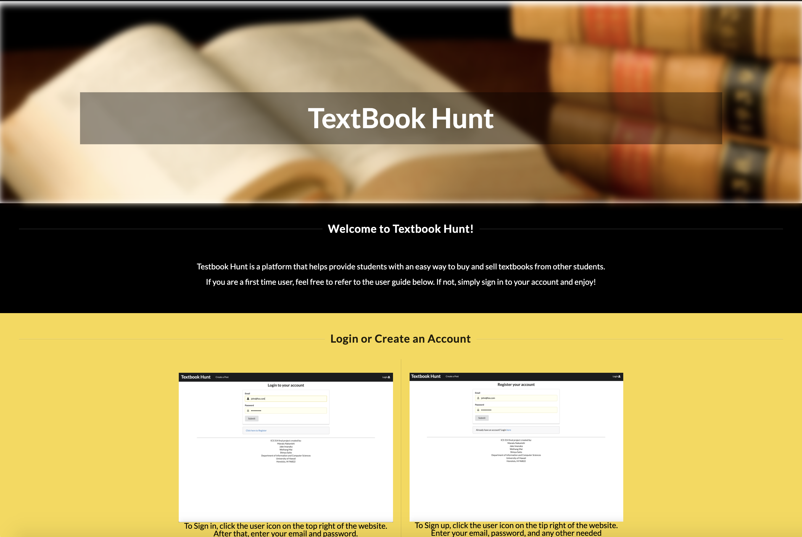
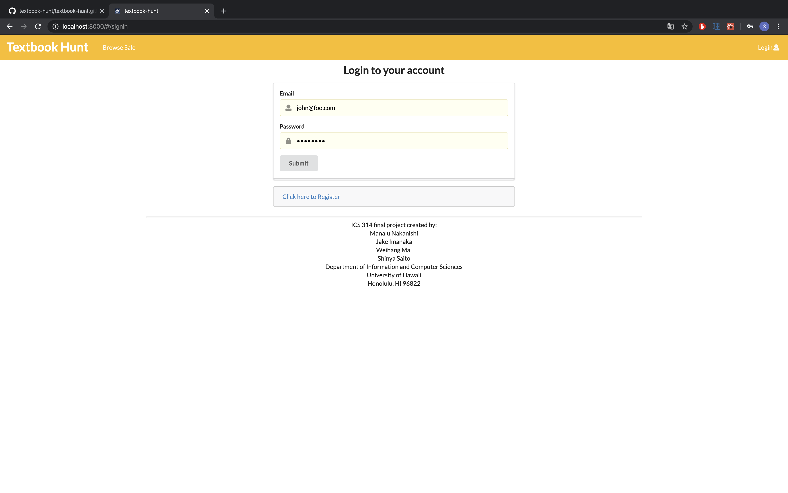
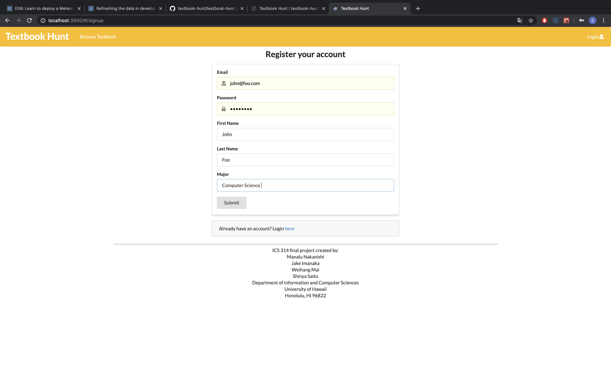

# Textbook Hunt

Here is the link to the textbook-hunt application: http://textbookhunt.meteorapp.com/#/ 
## Goal of the Project 

Textbook-Hunt provides college students with cheaper alternatives for textbooks and for students to buy and sell unneeded textbooks for additional pocket money. 

## Overview

Textbook-Hunt is a meteor application providing UH students with a market of used textbooks. When you arrive at the site the first thing you meet is the landing page. 

A UH student can log in with their UH account and create a profile in which they can post offers to sell a textbook. As a seller, you can list the different textbooks you are selling by listing the following: name of the textbook, subject department, conditions of the book (Excellent, Good, Okay, etc.), price, and additional comments about the book and the seller.

As a consumer, you can search by textbook name or subject department. Textbook-Hunt will provide a filter page for consumers to filter by condition, department, and/or by price. 

A consumer can then arrange with the seller for a payment plan and pick up a textbook. 

## Milestone 

### M1 
Here is the link to Milestone 1 where all the issues were worked from April 9th to April 15th. 
https://github.com/textbook-hunt/textbookhunt/projects/2

### M2 
Here is the link to Milestone 2 where all the issues that were worked from April 16th to April 28th. 
https://github.com/textbook-hunt/textbookhunt/projects/3

## Mockup Pages

* Landing Page  
Homepage explaining what the site does and how to use it.  Users can navigate the site or get to the signup/signin page. 

Here is the link to the landing page: https://textbook-hunt.github.io/.

* Signup/Signin Page  
New users can create an account or sign in to their existing account

Here is the link to the sign in page: http://textbookhunt.meteorapp.com/#/signin.

Here is the link to the sign up page to make an account: http://textbookhunt.meteorapp.com/#/signup
* User Home/Profile Page  
Users can see their textbook listings, ratings, etc

Here is the link to the listings page: 
* Listing/Posting Page  
Users can see the listings of many textbooks for sale.  The page will be sorted by ‘most recent postings’ by default.  Users can filter by subject and search by textbook name.

* Individual Listing Page  
Displays the textbook for sale with all of the offer’s information.  Details such as price, textbook name, image, etc. will be displayed.  There will also be an option to place an order for the item.

* Post Listing Page  
Users can post a listing for a textbook they own and wish to sell.  Users will provide details such as a picture of the book, name of the book, condition of the book, etc.

Here is the link for the page: http://textbookhunt.meteorapp.com/#/list
* Edit Listing Page  
Users can edit their existing textbook listings.  This includes changing metadata, descriptions, price, availability, etc.

Here is the link for the page: http://textbookhunt.meteorapp.com/#/edit/CY8yJrv4vaXYwSuMi

## Use Case Ideas 

* New user arrives to landing page 
* Sign in with their UH account and sets up a profile to sell or purchase 
* Returning users can log in with the log in back 
* Logged in students have the option to browse the offers or post new listing 
* Admin logs in and is able to edit and organize listings 

## Team Members:

* Manalu Nakanishi
  * Goals:
    * Learn how to work efficiently as a group on one coding project.
  * Skills:
    * Learns quickly
    * previous coding experience from prior ICS classes
    * good communicator
  * Contact: manalun@hawaii.edu
   
* Jake Imanaka
  * Goals:
    * Practice creating and managing dynamic web apps and databases.
  * Skills:
    * Group managment and task distribution
    * Previous coding experience from prior ICS classes
    * Light data management with web API's and JSON
  * Contact: jimanaka@hawaii.edu
   
* Weihang Mai (Ray)
  * Goals:
    * Learn more about react and build amazing web apps
  * Skills:
    * Currently learning react and angular
    * Experience with SQL databases
    * php web development experience
  * Contact: weihang@hawaii.edu
   
* Shinya Saito
  * Goals:
    * Practice professionalism in group work environments
  * Skills:
    * Proactive with a flexible mind
    * Experienced with the student-to-student textbook exchange proccess 
    * Created an inter-major textbook bookshelf
  * Contact: saitoshi@hawaii.edu
  
    

