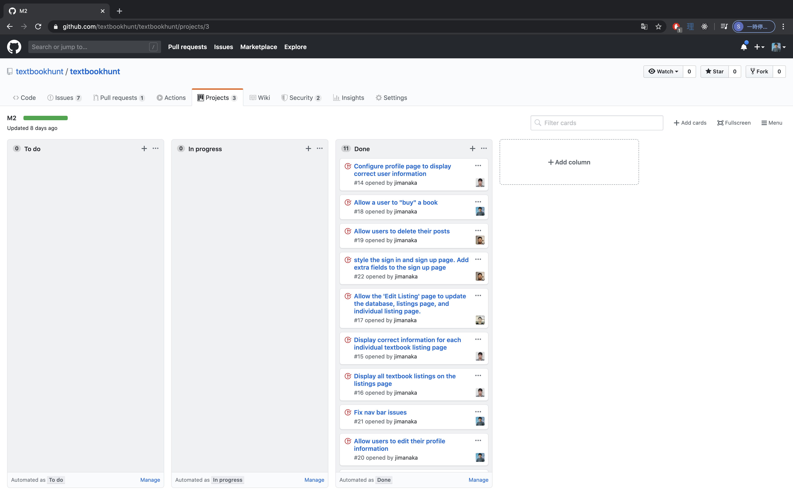
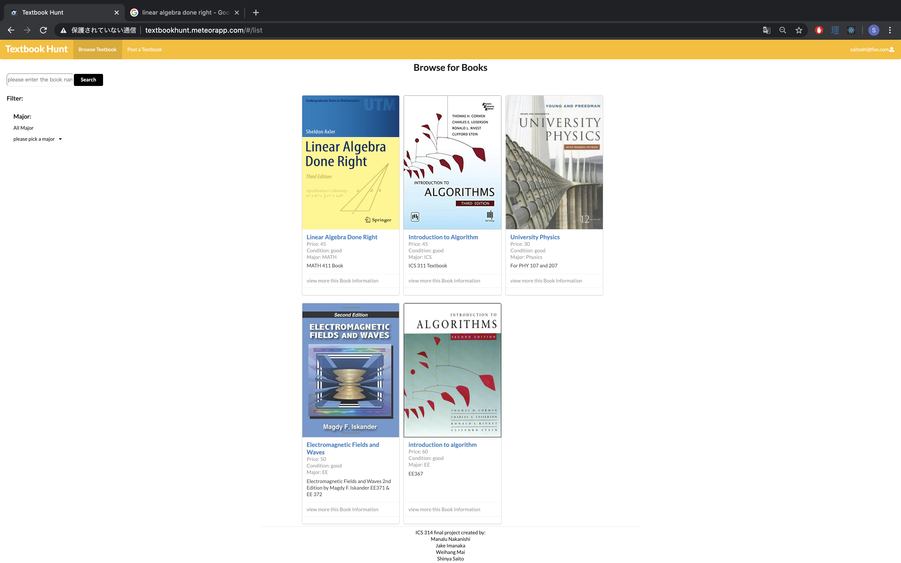
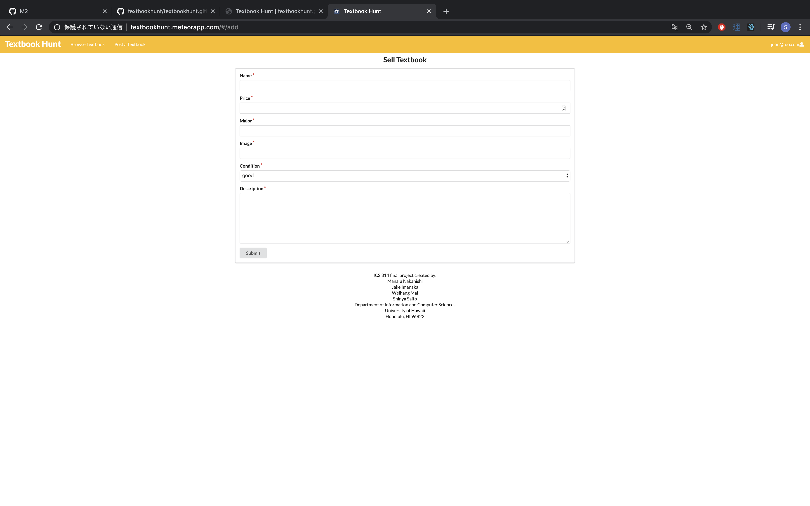
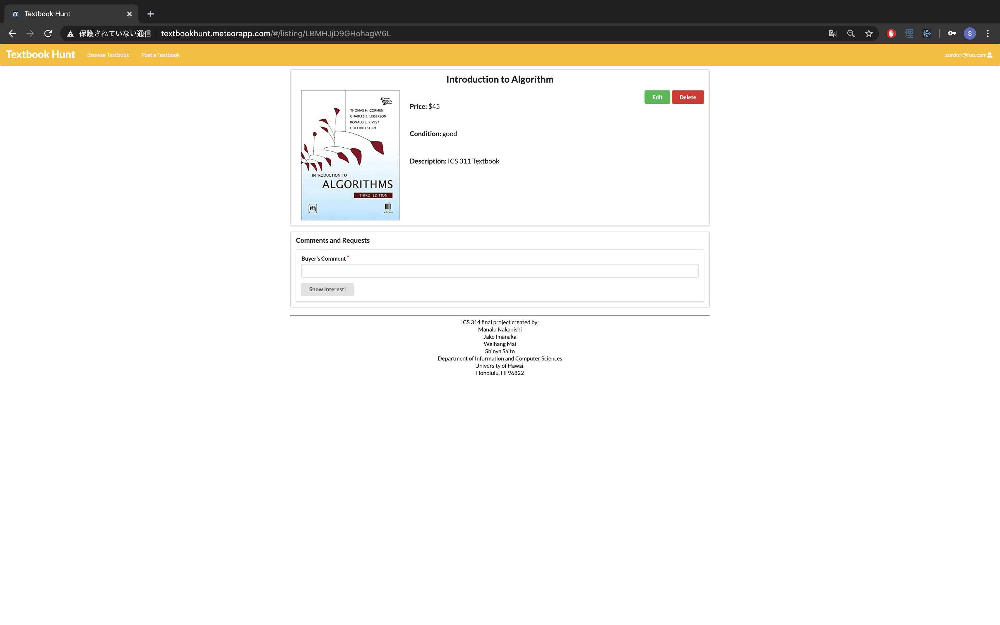

# Textbook Hunt

Here is the link to the [textbook hunt application](http://textbookhunt.meteorapp.com/#/).

Here is the [Textbook Hunt application github page](https://github.com/textbookhunt/textbookhunt) which cotains the source code.  

## Goal of the Project 

Textbook-Hunt provides college students with cheaper alternatives for textbooks and for students to buy and sell unneeded textbooks for additional pocket money. 

## Overview

Textbook-Hunt is a meteor application providing UH students with a market of used textbooks. When you arrive at the site the first thing you meet is the landing page. 

A UH student can log in with their UH account and create a profile in which they can post offers to sell a textbook. As a seller, you can list the different textbooks you are selling by listing the following: name of the textbook, subject department, conditions of the book (Excellent, Good, Okay, etc.), price, and additional comments about the book and the seller.

As a consumer, you can search by textbook name or subject department. Textbook-Hunt will provide a filter page for consumers to filter by condition, department, and/or by price. 

A consumer can then arrange with the seller for a payment plan and pick up a textbook. 

## Milestone 

### M1 

Here is the link to [Milestone 1](https://github.com/textbook-hunt/textbookhunt/projects/2) where all the issues were worked from April 9th to April 15th. 

### M2 

Here is the link to [Milestone 2](https://github.com/textbook-hunt/textbookhunt/projects/3) where all the issues that were worked from April 16th to April 28th. 

### M3 
Here is the link to [Milestone 3](https://github.com/textbookhunt/textbookhunt/projects/4) where all the issues were worked from April 28th to May 6th.

## User's Guide 

* Landing Page  
Homepage explaining what the site does and how to use it.  Users can navigate the site or get to the signup/signin page. 

Here is the link to the [landing page](https://textbook-hunt.github.io/).

* Signup/Signin Page  
New users can create an account or sign in to their existing account

Here is the link to the [sign in page](http://textbookhunt.meteorapp.com/#/signin).

Here is the link to the [sign up](http://textbookhunt.meteorapp.com/#/signup) page to make an account.
* Profile Page  
Once the user has created a profile, they can see their information and update it if necessary.

* Group Listing  
Here is the link to the listings page: 
Displays the textbook for sale with all of the offer’s information.  Details such as price, textbook name, image, etc. will be displayed.  There will also be an option to place an order for the item.

Here is the [link](http://textbookhunt.meteorapp.com/#/list) for the page.

* Post Listing Page  
Users can post a listing for a textbook they own and wish to sell.  Users will provide details such as a picture of the book, name of the book, condition of the book, etc.

Here is the [link](http://textbookhunt.meteorapp.com/#/add)  for the page. 

* Edit Listing Page  
Users can edit their existing textbook listings.  This includes changing metadata, descriptions, price, availability, etc.

Here is the [link](http://textbookhunt.meteorapp.com/#/edit/CY8yJrv4vaXYwSuMi) for the page.

* Listing Page  
Users will be met with this page when clicking on one of the posts that interests them.  Through this page, they can see the book name, price, condition, and description. They can also add a memo in order to purchase the book.  If the user posted the listing, they have the option to edit.

Here is the [link](http://textbookhunt.meteorapp.com/#/listing/8knbE62zBJLMD4cqn) for the page.

## Community Feedback 
- Connor K.,Undergraduate in Civil Engineering Major  
> Pretty simple to use and the theme is pretty good. 
- Axil , Undergraduate in Mathematics Education Major 
## Developer's Guide 

To download the source code please head over to the repository [page](https://github.com/textbook-hunt/textbookhunt) and download the master branch. 

To run the native app, cd into the master branch directory of your computers native terminal and get to the app folder.

Then, install meteor in the app folder using this command

Then run meteor npm run start within the app folder head to http://localhost:3000 to see the app running.

To modify the native source code, it is highly recommended that you use IntelliJ Idea to modify the source code to your liking. You can download it [here](https://www.jetbrains.com/idea/download/#section=mac).
## Team Members:

* Manalu Nakanishi
  * Goals:
    * Learn how to work efficiently as a group on one coding project.
  * Skills:
    * Learns quickly
    * previous coding experience from prior ICS classes
    * good communicator
  * Contact: manalun@hawaii.edu
   
* Jake Imanaka
  * Goals:
    * Practice creating and managing dynamic web apps and databases.
  * Skills:
    * Group managment and task distribution
    * Previous coding experience from prior ICS classes
    * Light data management with web API's and JSON
  * Contact: jimanaka@hawaii.edu
   
* Weihang Mai (Ray)
  * Goals:
    * Learn more about react and build amazing web apps
  * Skills:
    * Currently learning react and angular
    * Experience with SQL databases
    * php web development experience
  * Contact: weihang@hawaii.edu
   
* Shinya Saito
  * Goals:
    * Practice professionalism in group work environments
  * Skills:
    * Proactive with a flexible mind
    * Experienced with the student-to-student textbook exchange proccess 
    * Created an inter-major textbook bookshelf
  * Contact: saitoshi@hawaii.edu
  
    

